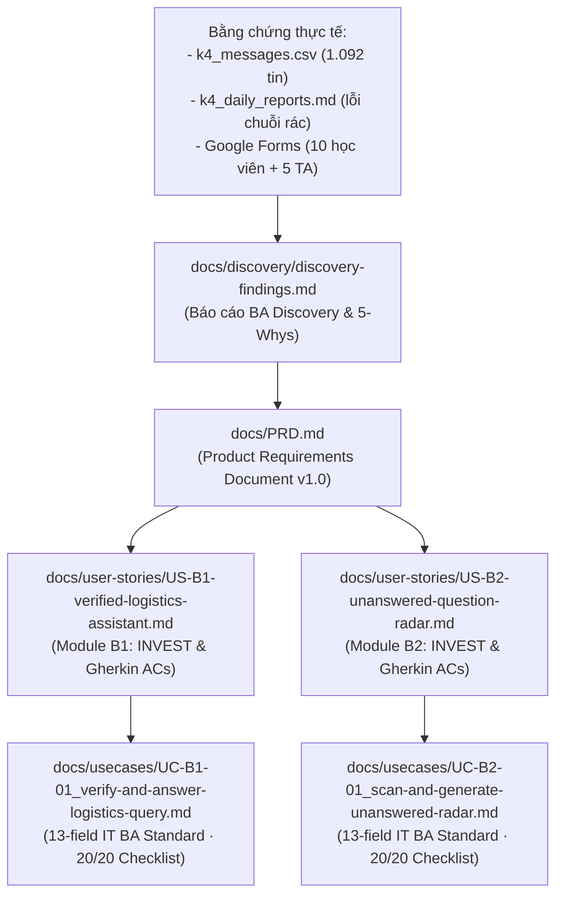

# Tài Liệu Đặc Tả Sản Phẩm & Phân Tích Nghiệp Vụ (Project Documentation)
**Track B: Trợ Lý Logistics Xác Thực & Radar Cứu Kẹt Discord**  
**Nhóm thực hiện:** EasyGame · Lớp 3B · Phòng E402  
**Product Lead / Lead BA:** Phạm Thành Đạt (2A202602721)

---

## 1. Cấu Trúc Tài Liệu Trong Thư Mục `docs/`

Thư mục `docs/` được tổ chức theo tiêu chuẩn quản lý sản phẩm chuyên nghiệp, kết hợp hài hòa giữa Khám phá yêu cầu (Discovery), Đặc tả sản phẩm cấp cao (PRD), Quản lý yêu cầu linh hoạt (User Stories chuẩn INVEST) và Đặc tả hệ thống chi tiết (Use Cases chuẩn IT BA quốc tế):

```
docs/
├── README.md                                  # [Bạn đang ở đây] Mục lục định hướng toàn bộ tài liệu
├── PRD.md                                     # Product Requirements Document hoàn chỉnh chuẩn quốc tế
├── discovery/
│   └── discovery-findings.md                  # Báo cáo Senior BA Elicitation (Ask-Why / BABOK v3)
├── user-stories/
│   ├── README.md                              # Bản đồ truy vết & Nguyên tắc thiết kế User Stories
│   ├── US-B1-verified-logistics-assistant.md  # Story B1: Trợ lý Logistics Xác thực & Intent Routing
│   └── US-B2-unanswered-question-radar.md     # Story B2: Radar Rà soát Câu hỏi Tồn & Bản tin Ngày
└── usecases/
    ├── README.md                              # Use Case Catalog & Actor Definitions
    ├── UC-B1-01_verify-and-answer-logistics-query.md
    └── UC-B2-01_scan-and-generate-unanswered-radar.md
```

---

## 2. Bản Đồ Truy Vết Nghiệp Vụ (End-to-End Traceability)



---

## 3. Danh Mục Tài Liệu Cốt Lõi

1. [**Product Requirements Document (PRD.md)**](file:///home/dat/dev/vinuni_aia/K4-3B-E402-EasyGame/docs/PRD.md):  
   Tài liệu đặc tả toàn diện gồm 12 chương: Vision, Value Proposition, Bằng chứng thực tế, Mục tiêu & Non-goals, 6 KPIs chính, 2 User Personas, Đặc tả chức năng (FR-101 đến FR-205), 7 NFRs kỹ thuật, 6 nguyên tắc HAX/PAIR, Ma trận 4 lớp chỗ khó ①②③④, Kế hoạch kiểm thử Golden Set (≥20 case) và Kế hoạch phân công nhân sự.
2. [**Báo Cáo BA Discovery (discovery-findings.md)**](file:///home/dat/dev/vinuni_aia/K4-3B-E402-EasyGame/docs/discovery/discovery-findings.md):  
   Kết quả phỏng vấn nghiệp vụ, phân loại BABOK 5 tầng yêu cầu, phân tích nguyên nhân gốc rễ 5-Whys và các quyết định chốt phạm vi cho Module B1 và B2.
3. [**Tập Hợp Agile User Stories (user-stories/)**](file:///home/dat/dev/vinuni_aia/K4-3B-E402-EasyGame/docs/user-stories/README.md):  
   Đặc tả yêu cầu ở góc độ người dùng theo chuẩn INVEST, kèm 10 kịch bản nghiệm thu Gherkin (Given-When-Then) bao quát đường thuận lợi, phân luồng ngữ nghĩa, ca ngoại lệ và phòng vệ an toàn.
4. [**Tập Hợp Use Case Specifications (usecases/)**](file:///home/dat/dev/vinuni_aia/K4-3B-E402-EasyGame/docs/usecases/README.md):  
   Đặc tả tương tác hệ thống theo chuẩn 13 trường IT BA quốc tế (Karl Wiegers / IIBA / Cockburn), luồng Normal Course tuần tự không rẽ nhánh lồng, kịch bản Alternative / Exception chặt chẽ và bảng kiểm định 20/20 tiêu chuẩn.
