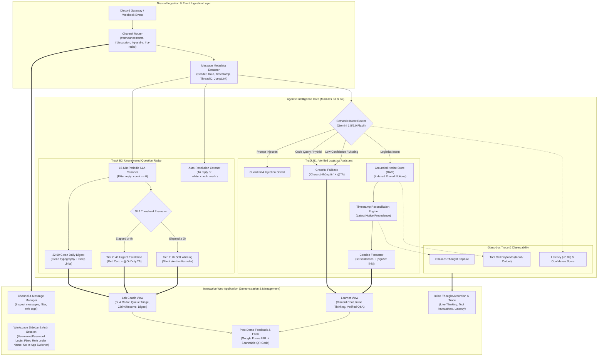

# High-Level System Architecture & Flow Specification
## EasyGame: Verified Logistics Assistant & Unanswered Question Radar (Track B)

> **Version:** v1.0 · **Target Milestones:** CP4 Blueprint Freeze → CP5 Prototype Live  
> **Traceability:** [docs/PRD.md](file:///home/dat/dev/vinuni_aia/K4-3B-E402-EasyGame/docs/PRD.md) · [CONTEXT.md](file:///home/dat/dev/vinuni_aia/K4-3B-E402-EasyGame/CONTEXT.md) · [docs/adr/](file:///home/dat/dev/vinuni_aia/K4-3B-E402-EasyGame/docs/adr/) · [docs/usecases/](file:///home/dat/dev/vinuni_aia/K4-3B-E402-EasyGame/docs/usecases/)

---

## 1. End-to-End System Architecture

The EasyGame platform operates across two synchronized planes: the **Discord Ingestion & AI Intelligence Core** (Modules B1 & B2) and the **Demonstration & Verification Web Application**.



---

## 2. Core System Components

### 2.1. Channel & Message Ingestion Manager
- **Channels Managed**:
  - `#announcements`: Ground truth authority (read-only for students, indexed for RAG).
  - `#discussion` / `#q-and-a`: Student inquiry channels (scanned by B1 & B2).
  - `#ta-radar`: Private staff-only operational channel for SLAs, escalations, and 22:00 Daily Digests.
- **Message Metadata Model**:
  ```typescript
  interface DiscordMessage {
    id: string;
    channelId: string;
    channelName: string;
    sender: {
      id: string;
      username: string;
      role: 'student' | 'labcoach' | 'instructor' | 'bot';
      avatarUrl?: string;
    };
    content: string;
    timestamp: string; // ISO 8601
    replyToId?: string;
    threadId?: string;
    replyCount: number;
    jumpUrl: string; // https://discord.com/channels/{guild}/{channel}/{id}
    status: 'OPEN' | 'IN_PROGRESS' | 'RESOLVED';
    slaStatus: 'NORMAL' | 'SOFT_WARNING_2H' | 'URGENT_4H';
  }
  ```

### 2.2. Track B1: Verified Logistics Assistant Engine
- **Intent Router**: Classifies queries into `Logistics_Deadline`, `Logistics_Attendance`, `Technical_Code`, `Chitchat`, or `Adversarial_Injection`.
- **Grounded Notice Store**: In-memory / vector store indexing pinned notices and organizer announcements.
- **Timestamp Reconciliation**: Compares publication timestamps across conflicting announcements; selects latest official update (e.g. extension from 21:00 Sep 17 to 12:00 Sep 19).
- **Concise Formatter**: Enforces strict ≤3 sentence and ≤300 character constraints with markdown citation link: `[Nguồn: Thông báo Lab 1 - #announcements]`.
- **Graceful Fallback**: Replaces hallucination with `"Hiện tại chưa có thông tin chính thức từ BTC... Mình đã tag @TA để hỗ trợ bạn nhé!"` whenever confidence < 0.70.

### 2.3. Track B2: Unanswered Question Radar
- **SLA State Machine**:
  - **< 2 hours**: Normal queue status.
  - **2–4 hours (Tier 1 Soft Warning)**: Formats silent notification card in `#ta-radar` with elapsed duration and deep link.
  - **≥ 4 hours (Tier 2 Urgent Escalation)**: Emits high-priority red card in `#ta-radar` with `@OnDuty_TA` mention.
- **Auto-Resolution Sync**: Automatically evicts tickets when a TA posts a reply or an emoji `:white_check_mark:` is detected.
- **22:00 Clean Daily Digest Generator**: Produces end-of-day summary with clean Vietnamese typography (zero corrupted tokens like `"nguồn tham chiếu"`) and one-click jump links.

### 2.4. Demonstration Webapp Views (Demo Flow)
1. **Workspace Sidebar & Auth Session**:
   - Authentication via Username & Password. The session determines the user's role (`Learner` or `Lab Coach`).
   - **No In-App Role Switcher**: Users cannot change roles in the UI.
   - When expanding the sidebar, the user's name is displayed along with their fixed role badge (`Role: Learner` or `Role: Lab Coach`) and auth metadata (`Auth: Username/Password` with lock icon).
   - Core sidebar navigation: `+ New Chat`, `Manage Channels`, `Tickets`, `Recent Chats`, `Notifications`, `Project`, and Settings.
2. **Channel & Message Manager**:
   - Telemetry stream of Discord messages ingested via Gateway bot.
   - Filter by channel, sender role, unresolved status, or SLA alert level.
   - Inspect raw metadata (Message ID, Discord Snowflake, Timestamp, Thread Status).
3. **Learner View**:
   - Clean, authentic Discord-styled chat interface with Black Cyan shadcn/ui theme.
   - Compact 1–2 sentence verified replies with citation deep link cards, file attachments, and TA ticket cards.
4. **Lab Coach / Staff Radar View**:
   - Unified triage dashboard for `#ta-radar`.
   - SLA Countdown badges (`2h 15m overdue`, `4h 30m URGENT`).
   - One-click actions: `[Jump to Discord]`, `[Claim Ticket]`, `[Mark Resolved]`.
   - Preview panel for the 22:00 Clean Daily Digest.
5. **Inline Thought Process & Transparency**:
   - Accordion component directly underneath user inquiries (`Thought Process · 1.1s`).
   - Step 1: Input query & extracted entities.
   - Step 2: Intent Classification & Guardrail validation.
   - Step 3: Tool Invocation (`query_pinned_notices`, `resolve_timestamps`, `escalate_to_radar`).
   - Step 4: Chain-of-thought internal reasoning trace.
   - Step 5: Latency metric (e.g., `1.12s`), Token usage, and Confidence score (e.g., `96.4%`).
6. **Post-Demo Validation & Survey Screen**:
   - Modal or dedicated closing view appearing upon completing the interactive demo.
   - Role-targeted survey tabs: **Student Survey** vs. **Lab Coach Survey**.
   - Direct Google Forms URL links (clickable).
   - High-resolution scannable QR code image for immediate smartphone scanning.

---

## 3. Detailed Data Flow Sequence

```mermaid
sequenceDiagram
    autonumber
    actor Learner as Enrolled Student
    participant WebUI as Demo Web Application
    participant Router as Intent Router
    participant RAG as Grounded Notice Store
    participant Agent as Agent Execution Engine
    actor LabCoach as On-duty Lab Coach

    Note over Learner, WebUI: Scenario: Learner asks deadline
    Learner->>WebUI: Types "@Assistant hạn nộp bài Lab 1 là mấy giờ?"
    WebUI->>Router: Dispatch MessageEvent with Metadata
    Router->>Agent: Intent: Logistics_Deadline (Confidence: 0.94)
    Agent->>RAG: Tool Call: query_pinned_notices("Lab 1 deadline")
    RAG-->>Agent: Returns 2 notices (Initial: 21:00 Sep 17; Extension: 12:00 Sep 19)
    Agent->>Agent: Execute Timestamp Resolution (Pick latest update)
    Agent-->>WebUI: Stream Agent Reasoning Trace to Glass-box Inspector
    Agent->>WebUI: Formatted Answer (≤3 sentences + [Nguồn: Thông báo #announcements])
    WebUI-->>Learner: Render inline Discord reply with clickable jump link

    Note over LabCoach, WebUI: Scenario: Question unanswered > 4h
    loop Every 15 Minutes
        Agent->>Agent: Background SLA Audit (reply_count == 0 && elapsed > 4h)
        Agent->>WebUI: Push Urgent Escalation Red Card to #ta-radar
    end
    WebUI-->>LabCoach: Alert Card with elapsed time + deep link
    LabCoach->>WebUI: Clicks "Jump to Thread" -> Posts Answer
    WebUI->>Agent: Emits Resolution Event -> Evicts from Radar
```
