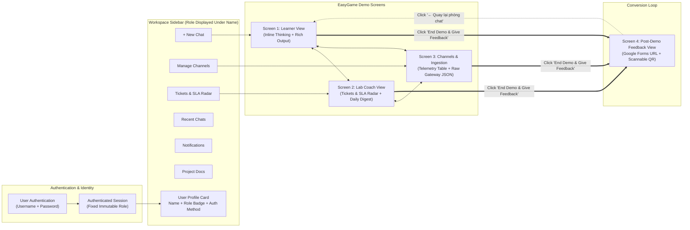

# Demonstration Webapp UI Flow & Architecture Specification
## EasyGame: Track B (Verified Logistics Assistant & Radar)

> **Stitch MCP Project ID:** `6020156630211700397` (`projects/6020156630211700397`)  
> **Design Theme:** `Technical Cyan Minimal` (`assets/5e469bbfda4340dfa0a6a1bf0ef384b0`) — Black Cyan shadcn/ui  
> **Design Rules:** No graphic logo/mascot (clean wordmark only), compact microcopy, zero text bloat, inline agent thinking (ChatGPT/Gemini style) with rich output attachments.  
> **Authentication & Role Policy:** Users authenticate using Username & Password. **No in-app role switcher or toggle.** The assigned role is statically displayed under the user's name when expanding the sidebar.  
> **Related Documents:** [docs/PRD.md](file:///home/dat/dev/vinuni_aia/K4-3B-E402-EasyGame/docs/PRD.md) · [CONTEXT.md](file:///home/dat/dev/vinuni_aia/K4-3B-E402-EasyGame/CONTEXT.md) · [docs/architecture/SYSTEM_ARCHITECTURE.md](file:///home/dat/dev/vinuni_aia/K4-3B-E402-EasyGame/docs/architecture/SYSTEM_ARCHITECTURE.md) · [docs/adr/](file:///home/dat/dev/vinuni_aia/K4-3B-E402-EasyGame/docs/adr/)

---

## 1. Executive Summary & Flow Hierarchy

The interactive demonstration webapp implements an end-to-end evaluation flow for **EasyGame Track B**, styled with the **Black Cyan shadcn/ui** design system (`#09090b` canvas, `#121215` / `#18181b` elevation cards, `#27272a` borders, and `#06b6d4` / `#22d3ee` cyan accent).

All role-switching controls have been completely removed. User roles (`Learner` vs `Lab Coach`) are determined exclusively by credential authentication (Username + Password) and displayed as read-only identity metadata under the user's name in the expanded workspace sidebar.

---

## 2. Design System Tokens (`ui-ux-pro-max` Black Cyan shadcn/ui)

| Layer | CSS Token | Hex Value | Application |
|---|---|---|---|
| **Canvas** | `--background` | `#09090b` | Base page background (pure zinc dark) |
| **Surface 1** | `--card` / `--surface-1` | `#121215` | Left sidebar, top navigation bars |
| **Surface 2** | `--popover` / `--surface-2` | `#18181b` | Chat bubbles, table rows, card containers |
| **Border** | `--border` | `#27272a` | Subtle dividers, badge borders, inputs |
| **Accent Primary** | `--primary` | `#06b6d4` / `#22d3ee` | Active tabs, primary buttons, citation borders |
| **Accent Glow** | `--ring` | `rgba(6,182,212,0.15)` | Focus rings, active button glow |
| **Urgent Breach** | `--destructive` | `#ef4444` | Tier 2 SLA breaches (> 4h overdue) |
| **Warning** | `--warning` | `#f59e0b` | Tier 1 SLA warnings (> 2h pending) |
| **Resolved / Online** | `--success` | `#10b981` | Completed tickets, bot active status |
| **Typography** | `font-sans` / `font-mono` | `Inter`, `JetBrains Mono` | Sans-serif UI, monospace badges and code |

---

## 3. Screen Specifications & Stitch Assets

### Screen 1: Minimalist Black Cyan Learner Chat with Inline Thinking
- **Screen ID:** `b13494005ce146a2a1ff4b4f01f79eca`
- **Stitch Resource:** `projects/6020156630211700397/screens/b13494005ce146a2a1ff4b4f01f79eca`
- **High-Res Visual:** [View Screenshot](https://lh3.googleusercontent.com/aida/AEtjO1UPW07f6BLlFLMp412uh8D4dI5SZFGUkC478KbPpkOwu9mNhKLBBg9rMn6UXnpm_uz8rU57r5tCeSoEil98gi-RVTYq2Aj8Qn8w5qHA6FHw5HQyF3ZlzZDI7fh63j9TlCa48xYEBL_m-d4qm_HjLP83Ln1ktXoAnjUMfRnz2HAr7-9fF6xOr09MoF5dE2viAr8z9-YmhJ0oRLVbLuKnfK0BCW6DZWavjcvW_GwUZKr-36s0Ahuvq0_2YW4)
- **Functional Highlights:**
  1. **Workspace Sidebar Navigation:** Standardized sidebar with `+ New Chat`, `Manage Channels`, `Tickets`, `Recent Chats`, `Notifications`, `Project`, and Settings.
  2. **Wordmark Branding:** No graphic logos or mascots; clean typographic wordmark `EasyGame` with small cyan monospace badge `[Track B]`.
  3. **Sidebar Authenticated Identity (No Role Switcher):**
     - Completely removed the persona switch segmented control.
     - When sidebar is expanded, the user profile bar displays:
       - User handle: `@NguyenVanAn`
       - Fixed role badge: `Role: Learner` (with primary cyan status dot)
       - Auth method metadata: `🔒 Auth: Username/Password` in monospace text.
  4. **Inline Thought Process Accordion (ChatGPT/Gemini Style):**
     - Directly nested beneath the user inquiry (`@Assistant deadline Lab 1 mấy giờ?`).
     - Displays `Thought Process · 1.1s` collapsible card.
     - Step-by-step telemetry: Tool invocation badge (`Calling query_pinned_notices`), temporal resolution verification comparing Notice #1 (18/09) vs Notice #2 (19/09 12:00), and factuality verification (100% grounded).
  5. **Ultra-Concise Grounded Answer:** Strictly 1–2 sentences: *"Hạn chót nộp Lab 1 đã được gia hạn đến 12:00 trưa Thứ Bảy, 19/09/2026."*
  6. **Rich Resource Attachments & Deeplinks:**
     - `[📌 #announcements ↗]`: Discord jump URL to the official announcement message.
     - `[📄 Lab1_Specification.pdf]`: Downloadable assignment rubric.
     - `[🔗 GitHub Classroom ↗]`: Link to code repository submission.
     - `[🎫 Ticket #104 (In Queue)]`: Automatic TA escalation ticket card showing status.

---

### Screen 2: Tickets & SLA Radar (Lab Coach View)
- **Screen ID:** `68cfaaa698e0428aa090a6f4dcd9a743`
- **Stitch Resource:** `projects/6020156630211700397/screens/68cfaaa698e0428aa090a6f4dcd9a743`
- **High-Res Visual:** [View Screenshot](https://lh3.googleusercontent.com/aida/AEtjO1XRkmcQuwBP-JEjAroV5VxtnQOKwi_D3M74iSIlD6XkdZTGA5CPAZFIsePYn8A96wQ_4coHXev6nJBwoVpWG1VBJb1J5Qf3ByTi77hD6iWsMNlU4lTKAWoFTcIj8NHfdnXkBSYYnOB_aEshnrQ_Z5O9QFi7Yy97W0dcCACatJrB_nd9sn5ScBq2vMe1a8Ri_b0OCA92F1Vt5iAevSdM9Av3i5iUxjrhZPRVzqIhWAoCeNvMTRAvYozRO9g)
- **Functional Highlights:**
  1. **Top KPI Metrics Strip:** Real-time counters with micro badges: `Urgent Breaches >4h: 2`, `Soft Warnings >2h: 3`, `Resolved Today: 28/33`, `SLA Compliance: 94.2%`.
  2. **Sidebar Authenticated Identity (No Role Switcher):**
     - Completely removed the `Learner` vs `Lab Coach` switcher block.
     - Profile section displays:
       - User handle: `@TA_MinhHai`
       - Fixed role badge: `Role: Lab Coach` (with cyan status dot)
       - Auth method metadata: `🔒 Auth: Username/Password`.
  3. **Tiered SLA Radar Kanban / Queue:**
     - **Tier 2 Urgent Alert Card (Red border #ef4444):** Overdue inquiry (4h 18m) by `@MinhTuan_K4` asking for debugging assistance on `load_dataset`. Includes `@TA_OnDuty` tag, direct jump `[🚀 Nhảy tới tin nhắn Discord ↗]`, and `[✋ Claim Ticket]`.
     - **Tier 1 Soft Warning Alert Card (Amber border #f59e0b):** Silent alert (2h 25m) for `@KhanhLinh` regarding attendance rules without noisy pings.
     - **Resolved Card (Emerald border #10b981):** Solved ticket with resolution latency (42m).
  4. **22:00 Clean Daily Digest (Right Pane):**
     - End-of-shift consolidated report eliminating legacy bugs (zero text truncation or syllable repetition).
     - Ranked Top 3 confused topics of the day.
     - One-click broadcast button `[Broadcast to #ta-radar]`.

---

### Screen 3: Manage Channels & Message Ingestion View
- **Screen ID:** `5af52ceb62aa499c8a9c1a694e021e75`
- **Stitch Resource:** `projects/6020156630211700397/screens/5af52ceb62aa499c8a9c1a694e021e75`
- **High-Res Visual:** [View Screenshot](https://lh3.googleusercontent.com/aida/AEtjO1UkDOajbH-Xwi7CS8vwH8clmPDwozwvO_sdWKhZkzyGdkOh-UufDd0mYZg8ldH8iUja0-O-DX4CmlTaWTWLCaalRSTuXPVAiwP28v_bu5p0W70dROpSdJS_tETN1IuElnvuaStKM1tEND5IzRvFTtFb1H_a-3HoizksCFD78d5kitWTYwSy8mcdmSbJhtU08UD1f95v9v5nvTobFTheI7lVhL93H5qreYdH8YB2B3UGMBgfBi-yifTOT1E)
- **Functional Highlights:**
  1. **Sidebar Authenticated Identity (No Role Switcher):**
     - Removed `Learner Persona` segmented control.
     - Profile footer displays `@TA_MinhHai`, `Role: Lab Coach · Duty E402`, and `🔒 Auth: Username/Password`.
  2. **Channel Source Management Rail:** Left card list tracking synced Discord channels (`#announcements` [Ground truth source, 4 pinned notices], `#discussion` [779 messages], `#q-and-a`, `#ta-radar`).
  3. **Comprehensive Ingestion Telemetry Table:** Columns for Discord Snowflake ID, Timestamp, Channel, Author Role, Message Content Snippet, Detected Intent, Grounded Status, and Agent Latency.
  4. **Dual Inspector Drawer (Bottom Panel):**
     - **Left:** Raw Discord Gateway JSON viewer (`snowflake_id`, `guild_id`, `channel_id`, `author`, `jump_url`).
     - **Right:** Agent reasoning step log showing intent classification, pinned notice retrieval, temporal conflict resolution, and factuality score.

---

### Screen 4: Post-Demo Feedback & Scannable QR Code
- **Screen ID:** `c5c213179f64496cab1981521407b073`
- **Stitch Resource:** `projects/6020156630211700397/screens/c5c213179f64496cab1981521407b073`
- **High-Res Visual:** [View Screenshot](https://lh3.googleusercontent.com/aida/AEtjO1Wg_gIkjwyALFuNegbK1bxifebN1d6I79LVFiip1X6g1zMfCHZPNDZIbtSY4qstxGkmR2vAZTrFU5cGF1ZS4XAUm2pByaT4vtBNjP2rUew_EccMQizMjWOyImiWCGU7cCAf-BAlAEfmERIMYBY3wfW_vxytm_uojzurciZuVFsZihnzZ3lq6ZvQE0vd4KMMpJyuh1tvRXgYQ0TWdj-dfJ1jeIXUBEGpk6AaTwhEAgQj070FEOZIMI67-gU)
- **Functional Highlights:**
  1. **Dual Evaluation Paths:**
     - **Direct Survey Form Access (Left):** Prominent button and copyable link for [Học Viên Google Form](https://docs.google.com/forms/d/e/1FAIpQLScfANQUiUfT76tDvtIFgPlmA1vdJwL0aKcs_jEdQ7-UKAD4BA/viewform) with embedded micro-survey (5-star factuality rating, conciseness check, willing user opt-in).
     - **Mobile Scannable QR Code Card (Right):** High-contrast, scannable QR code centered with camera instructions for immediate smartphone capture without leaving the desk.
  2. **Targeted Survey Selectors:** Switchable between Student Survey (`1axytKPkex...`) and Lab Coach Survey (`1xQQhyfZD...`).
  3. **Willing User Conversion:** Collects Discord usernames directly to power Canvas Line 6 and recruit testers for live prototype validation.

---

## 4. Interaction & Demonstration Runbook

| Phase | User Action in Demo Web | System Behavior & Observed Screen State |
|:---:|---|---|
| **Phase 0: Login** | Evaluator logs in with Username & Password (e.g., `learner_demo` or `coach_demo`). | System initiates authenticated session. Sidebar expands showing user avatar, name, fixed role badge (`Role: Learner` or `Role: Lab Coach`), and `Auth: Username/Password`. No role switcher control exists. |
| **Phase 1: Learner Chat** | Evaluator in Learner session types `@Assistant deadline Lab 1 mấy giờ?` | Bot responds in ≤1.2s. Below the inquiry, the `Thought Process · 1.1s` accordion displays active tool invocation (`query_pinned_notices`), temporal resolution verification, and produces a 1-sentence answer with Discord deeplink `[#announcements ↗]`, PDF file `[Lab1_Spec.pdf]`, and submitted TA ticket card `[#104]`. |
| **Phase 2: Coach Radar** | Evaluator in Lab Coach session clicks **Tickets** in the workspace sidebar. | View transitions to `#ta-radar` staff dashboard. Evaluator sees active red alert (>4h overdue) for `@MinhTuan_K4`, clicks `Nhảy tới tin nhắn Discord ↗`, and inspects the 22:00 clean daily digest preview. |
| **Phase 3: Channel Telemetry** | Evaluator clicks **Manage Channels** in the sidebar. | Evaluator reviews channel synchronization health, filters incoming messages by `Escalated >4h`, and inspects raw gateway JSON metadata alongside agent reasoning steps. |
| **Phase 4: Feedback & QR** | Evaluator clicks top-right button **`End Demo & Give Feedback (QR Form)`**. | Screen 4 opens presenting the congratulatory completion banner, direct Google Forms button, and high-visibility QR code for instant mobile survey submission. |
