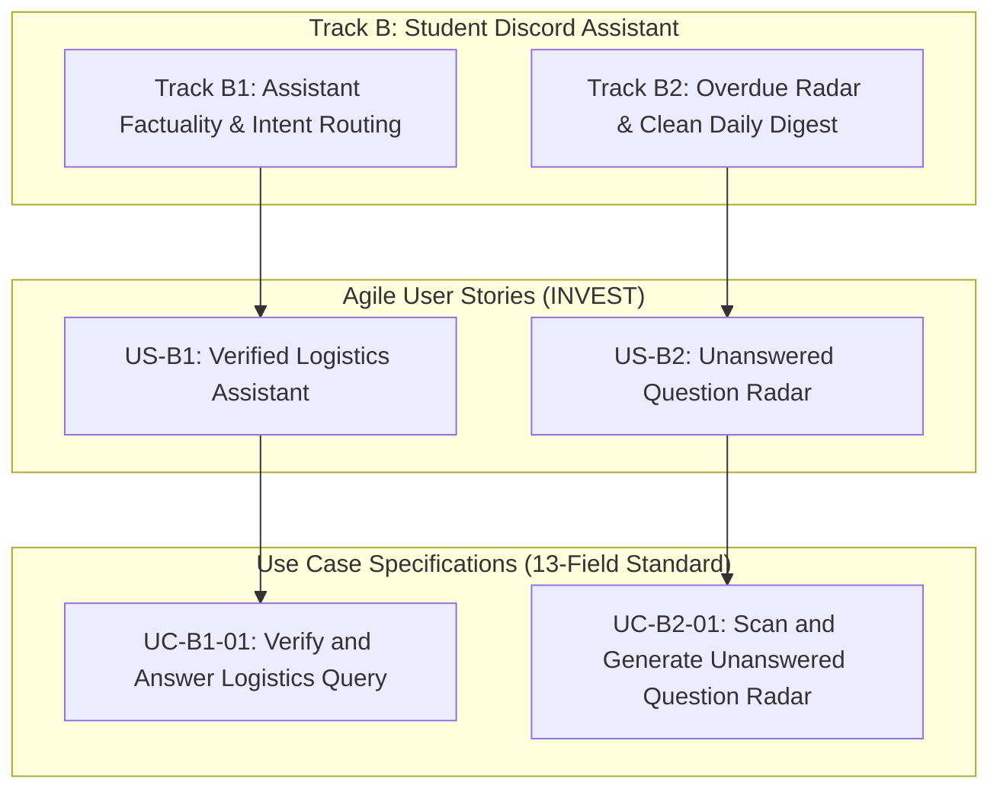

# Use Case Specifications Catalog — Track B: Student Assistant & Radar
**Project:** Verified Logistics Assistant & Unanswered Question Radar (Track B: B1 & B2)  
**Team:** EasyGame · Class 3B · Room E402  
**Framework:** IT Business Analyst Standard (Karl Wiegers / IIBA BABOK v3 / Alistair Cockburn)  
**Skill Reference:** `use-case-writer` · BA Zone & Digital School  
**Language:** English (Standard Technical Specification)

---

## 1. Actor Catalog

| Actor | Type | Description | Primary Goal in System |
|---|---|---|---|
| **Enrolled Student** | Primary | A learner participating in the bootcamp Discord server. | Queries official deadlines, attendance rules, and submission procedures quickly and accurately without misinformation. |
| **On-duty Lab Coach (TA)** | Primary | A teaching assistant or moderator responsible for live classroom and Discord support. | Monitors overdue/unanswered student inquiries, receives actionable radar alerts with deep links, and avoids answering duplicate logistics questions. |
| **Official Notice Grounding Engine** | Secondary (System) | RAG retrieval module indexing pinned notices, official announcements, and syllabus updates. | Validates student questions against verifiable sources of truth before generating responses. |
| **Discord Messaging Platform** | Secondary (System) | The communication infrastructure hosting public channels (`#discussion`, `#announcements`) and the private staff channel (`#ta-radar`). | Transports messages, manages thread subscriptions, and dispatches webhook notifications. |

---

## 2. Use Case Catalog

| Use Case ID | Use Case Name | Primary Actor | Scope Level | Target Module |
|---|---|---|:---:|:---:|
| [**UC-B1-01**](file:///home/dat/dev/vinuni_aia/K4-3B-E402-EasyGame/docs/usecases/UC-B1-01_verify-and-answer-logistics-query.md) | **Verify and Answer Logistics Query** | Enrolled Student | User-Goal (Sea level) | Track B1 (Assistant Optimization) |
| [**UC-B2-01**](file:///home/dat/dev/vinuni_aia/K4-3B-E402-EasyGame/docs/usecases/UC-B2-01_scan-and-generate-unanswered-radar.md) | **Scan and Generate Unanswered Question Radar** | On-duty Lab Coach (TA) | User-Goal (Sea level) | Track B2 (Staff Radar & Daily Digest) |

---

## 3. Traceability to Business Canvas & Track Objectives

---

## 4. Quality Governance

Every Use Case specification within this directory conforms to:
1. **The 13-Field Standard IT BA Template:** Covering complete Actor definitions, verifiable Pre/Postconditions, strict alternating Normal Courses (Actor vs System), Alternative Courses, Exceptions, and Non-functional constraints.
2. **Cockburn's Sea-Level Scoping:** Passing the Coffee-Break Test (one actor, one session, one distinct business goal).
3. **The 20-Point Quality Checklist (C1–C20):** Formally validated with zero failed items before deployment.
