# Use Case Specifications Catalog — Track B: Student Assistant & Radar
**Project:** Verified Logistics Assistant & Unanswered Question Radar (Track B: B1, B2 & B3)  
**Team:** EasyGame · Class 3B · Room E402  
**Framework:** IT Business Analyst Standard (Karl Wiegers / IIBA BABOK v3 / Alistair Cockburn)  
**Skill Reference:** `use-case-writer` · BA Zone & Digital School  
**Language:** English (Standard Technical Specification)

---

## 1. Actor Catalog

| Actor | Type | Description | Primary Goal in System |
|---|---|---|---|
| **Learner** | Primary | An enrolled participant in the bootcamp cohort holding an immutable `learner` role. | Queries official deadlines, attendance rules, and submission procedures quickly and accurately without misinformation. |
| **On-duty Lab Coach (TA)** | Primary | A teaching assistant or moderator holding an immutable `lab_coach` role. | Monitors overdue/unanswered student inquiries, receives actionable radar alerts, triages and replies directly in the Messages view, broadcasts announcements, and inspects student profiles/scores. |
| **Authenticated User** | Primary | A newly authenticated user (via Discord OAuth, Google, or email) completing first sign-in. | Completes onboarding role selection (Stitch Screen `7488d0bd017b434aaf0d0e2ef6f567ea`) to permanently lock their cohort role and calibrate permissions. |
| **Official Notice Grounding Engine** | Secondary (System) | RAG retrieval module indexing pinned notices, official announcements, and syllabus updates. | Validates student questions against verifiable sources of truth before generating responses. |
| **TypeScript AI-SDK Engine** | Secondary (System) | Tool abstraction and runtime parser (`ai` package) executing role-gated tools from `tools.yaml`. | Enforces strict role boundaries, dynamically filtering tool declarations and rejecting unauthorized inquiries. |
| **Discord Messaging Platform** | Secondary (System) | The external communication infrastructure hosting public channels and the private staff channel (`#ta-radar`). | Transports messages and provides authentic deep links for live channel engagement. |

---

## 2. Use Case Catalog

| Use Case ID | Use Case Name | Primary Actor | Scope Level | Target Module |
|---|---|---|:---:|:---:|
| [**UC-B1-01**](UC-B1-01_verify-and-answer-logistics-query.md) | **Verify and Answer Logistics Query** | Learner | User-Goal (Sea level) | Track B1 (Assistant Optimization) |
| [**UC-B1-02**](UC-B1-02_execute-role-gated-assistant-tool.md) | **Execute Role-Gated Assistant Tool via AI-SDK** | Learner / Lab Coach | User-Goal (Sea level) | Track B1 (Tool Governance & RBAC) |
| [**UC-B2-01**](UC-B2-01_scan-and-generate-unanswered-radar.md) | **Scan and Generate Unanswered Question Radar** | On-duty Lab Coach (TA) | Sub-function / Mixed | Track B2 (Staff Radar & Daily Digest) |
| [**UC-B2-02**](UC-B2-02_triage-and-reply-in-messages-view.md) | **Triage and Reply to Dropped Question in Messages View** | On-duty Lab Coach (TA) | User-Goal (Sea level) | Track B2 (In-App Messages & Direct DB Reply) |
| [**UC-B3-01**](UC-B3-01_run-authenticated-tool-agent.md) | **Run Authenticated Tool-Using Course Agent** | Learner / Lab Coach | User-Goal (Sea level) | Shared Auth, Assistant, and Radar orchestration |
| [**UC-B3-02**](UC-B3-02_select-and-lock-cohort-role-onboarding.md) | **Select and Lock Cohort Role via Onboarding** | Authenticated User | User-Goal (Sea level) | Track B3 (First Sign-In Onboarding) |
| [**Implementation coverage**](IMPLEMENTATION_COVERAGE.md) | **Trace Use Cases to Foundation** | BA / Engineering | Review artifact | Cross-Track Quality Review |

---

## 3. Traceability to Business Canvas & Track Objectives

```mermaid
flowchart TD
    subgraph Track_B ["Track B: Student Discord Assistant & Operations"]
        B1["Track B1: Assistant Factuality & Role-Gated Tools"]
        B2["Track B2: Overdue Radar & In-App Messages Triage"]
        B3["Track B3: First Sign-In Onboarding & Role Lock"]
    end

    subgraph User_Stories ["Agile User Stories (INVEST)"]
        USB1["US-B1: Verified Logistics Assistant"]
        USB2["US-B2: Unanswered Question Radar"]
        USB3["US-B3: Authenticated Tool Agent"]
        USB4["US-B4: Role Onboarding & Permission Lock"]
        USB5["US-B5: In-App Messages Triage & Direct DB Reply"]
    end

    subgraph Use_Cases ["Use Case Specifications (13-Field Standard)"]
        UCB1["UC-B1-01: Verify & Answer Logistics Query"]
        UCB12["UC-B1-02: Role-Gated Tool Execution"]
        UCB2["UC-B2-01: Scan & Generate Unanswered Radar"]
        UCB22["UC-B2-02: Triage & Reply in Messages View"]
        UCB3["UC-B3-01: Run Authenticated Tool Agent"]
        UCB32["UC-B3-02: First Sign-In Role Lock Onboarding"]
    end

    B1 --> USB1
    B1 --> UCB1
    B1 --> UCB12
    B2 --> USB2
    B2 --> USB5
    B2 --> UCB2
    B2 --> UCB22
    B3 --> USB3
    B3 --> USB4
    B3 --> UCB3
    B3 --> UCB32
```

